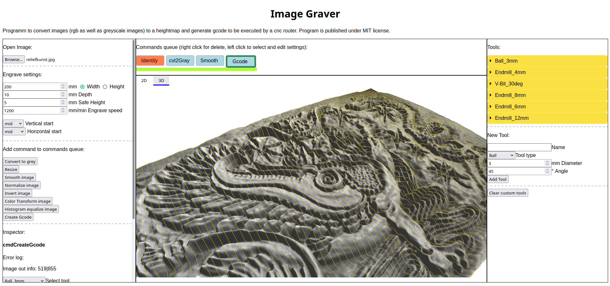
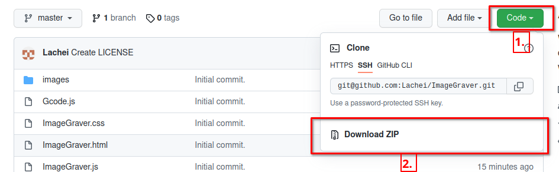

# Image Graver

||
| ------ |

Image Graver is an open source tool to convert images to 3d reliefs and create g-code routing information to be used with cnc routers.

The program only relies on javascript for dataprocessing and thus runs fully in your browser without the need of any additional installations. All code is provided with this project.

Tool supports conversion of color images to heightfields, 2d/3d heightfield inspection, basic image operations on the heightfield and gcode export for cnc routers.

For usage read the not yet finished [user docs](https://github.com/Lachei/ImageGraver/wiki)

## License

The program is published under the MIT License and is free to use and adpot. No guarantees given!

Retrieve a copy of the license [here](LICENSE).

## Usage

To use the website with internet connection simply click [here](https://htmlpreview.github.io/?https://github.com/Lachei/ImageGraver/blob/master/ImageGraver.html).

If no internet connection can be established simply download all source files by either clicking [here](https://github.com/Lachei/ImageGraver/archive/refs/heads/master.zip), 

or clicking the download as `.zip` button.

Unpack the downloaded `.zip` file and double click on ImageGraver.html. The website should then be opened in your browser.